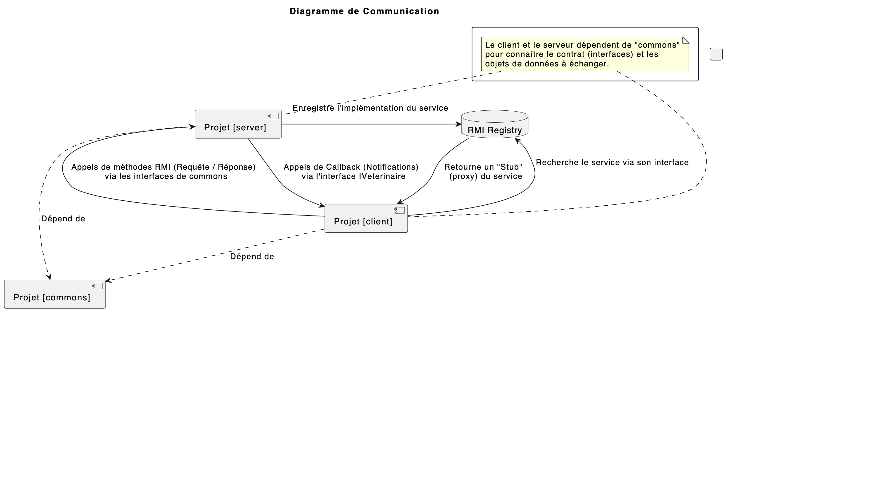

# Projet RMI - Cabinet Vétérinaire

Ce projet est une démonstration d'une application client-serveur utilisant Java RMI (Remote Method Invocation) avec Spring Boot. Il simule la gestion d'un cabinet vétérinaire.

## Architecture

Le projet est divisé en trois modules Maven distincts pour assurer une séparation claire des responsabilités :

*   `commons`: Bibliothèque partagée, il définit les interfaces RMI (`ICabinet`, `IAnimal`, etc.) et les objets de données sérialisables échangés entre le client et le serveur.
*   `server`: Application Spring Boot qui héberge l'implémentation concrète du service RMI. Il gère la logique et l'état de l'application (en mémoire).
*   `client`: Application Spring Boot qui agit comme un client RMI. Elle fournit une interface en ligne de commande pour permettre à un utilisateur d'interagir avec le service distant.

## Fonctionnalités Principales

*   **Gestion d'un cabinet vétérinaire** : Opérations CRUD (Create, Read, Update, Delete) pour les animaux.
*   **Communication Bidirectionnelle** : Le serveur peut notifier les clients enregistrés grâce à un système de **callback** lorsque le nombre de patients dépasse un certain seuil.
*   **Téléchargement de code** : Le projet illustre la capacité de RMI à charger dynamiquement des classes non connues du serveur au moment de la compilation.

## Prérequis

*   Java SDK 11 ou inferieur.
*   Apache Maven.

## Lancement de l'application

L'ordre de lancement est important. Vous devez d'abord compiler `commons`, puis lancer le `server`, et enfin le `client`.

**1. Compiler le module `commons`**

Ce module doit être installé pour que le client et le serveur puissent l'utiliser.

```bash
cd commons
mvn clean install
```

**2. Lancer l'application `server`**

Ouvrez un nouveau terminal.

```bash
cd server
mvn spring-boot:run
```
Le serveur va démarrer et attendre les connexions des clients.

**3. Lancer l'application `client`**

Ouvrez un troisième terminal.

```bash
cd client
mvn spring-boot:run
```
L'application client se lancera et vous présentera un menu interactif dans la console.

## Diagramme d'Architecture

<details>
<summary>Cliquez pour voir le diagramme de communication haut niveau</summary>



</details>
